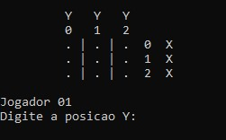

# Jogo da velha

Este é um projeto simples do clássico Jogo da Velha, desenvolvido em linguagem C. O jogo permite que dois jogadores se desafiem em uma partida, com uma interface de texto intuitiva para selecionar as jogadas. A lógica do jogo garante a verificação de condições de vitória ou empate, oferecendo uma experiência de jogo funcional e interativa.

## 🛠️ Construído com

*  Linguagem C
## ✒️ Autores

* **Línicker Ostroski Mota** 
